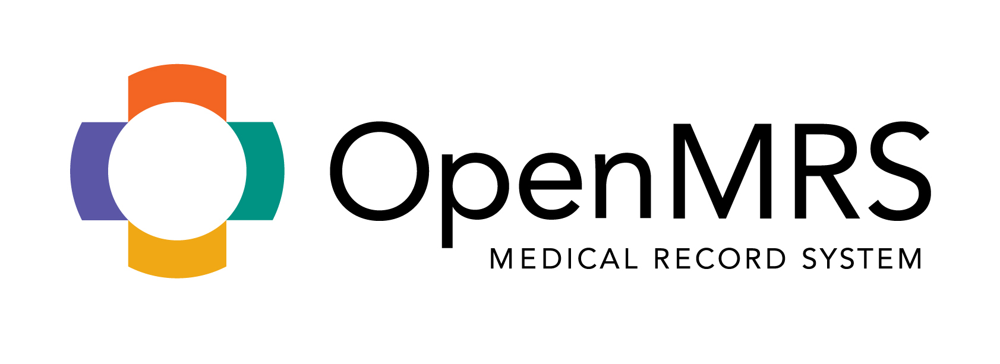

# OpenMRS Distribution for Micro Frontends


-----

This repository maintains the 'distro POM' for the _OpenMRS Distribution for Micro Frontends_.

It downloads and brings in one place all artifacts needed by the distribution, simply run:
```bash
mvn clean package
```

This distribution can be used as a parent distribution when implementing any MF-based OpenMRS distribution. It already ships out of the box with a number of useful common features useful for a standard project: registration, clinical charts, concept dictionary, ... etc.

To use it, simply refer to it as a `<parent>` in a child distribution's **pom.xml** file:
```xml
<parent>
  <groupId>net.mekomsolutions</groupId>
  <artifactId>openmrs-distro-mf</artifactId>
  <version>1.0.0</version>
</parent>
```

### Output directory:

* `openmrs_modules/`
<br/>The required set of OpenMRS modules.
* `openmrs_config/`
<br/>The OpenMRS bespoke configuration (more [here](https://github.com/mekomsolutions/openmrs-config-haiti)) to be processed by the [Initializer module](https://github.com/mekomsolutions/openmrs-module-initializer).
* `openmrs_core/`
<br>The target version of OpenMRS Core.</br>
* `frontends/`
<br>The required set of Micro-Frontends.</br>
